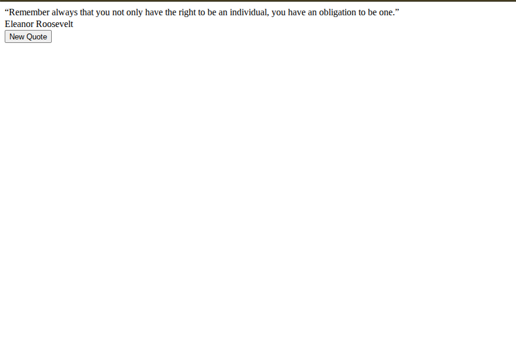
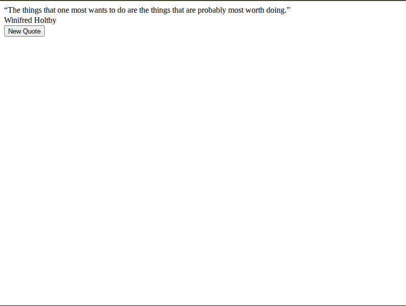

# Entry 2
##### 12/21/25

### Content<!--Evidence of learning from the logs for our tool. Keep in mind that our work looks slighty different from the first blog amd so it has to be explained and broken down in detail.-->

During my time learning more about my tool and doing my project I found that in order for my tool to completely work I had to work around the constraints of JSON and and use JSONP since I was putting my time into the forismatic website which was a good server to test my JSON tool. When I was doing more research on the JSONP part of my tool I could use it because this site was like an older version of modern servers so I had to change some things with calling the site for quotes. At this point I found that it was more useful to obtain the quotes JSON couldn't because of inconsisties. The current code that I made so far utilizes a callback function with different elements associated with helping it to retrieve quotes by being general and specific about what to ask for. The function goes to the server and says, hey here is the format that I want my quote to be in and the site provides the quote based on what the function needs quickly and so the function displays that same quote which works well


```
function fetchdata() {

    const callbackName = "forismaticCallback_" + Math.random().toString(36).substring(2);

    window[callbackName] = function(data) {
        document.getElementById("quote").textContent = "“" + data.quoteText.trim() + "”";
        document.getElementById("author").textContent = data.quoteAuthor || "Unknown";

        delete window[callbackName];
        script.remove();
    };

    const script = document.createElement("script");
    script.src = `https://api.forismatic.com/api/1.0/?method=getQuote&format=jsonp&lang=en&jsonp=${callbackName}`;
    document.body.appendChild(script);
}

```
Now here is what that looks like so far.
*  First quote
*  Second quote
### Sources
* [Jsonp video](https://www.youtube.com/watch?v=EKaic2TjMAM&t=562s)
* [learning about JsonP](https://beeceptor.com/docs/concepts/jsonp-introduction/)
### EDP<!--What step of engineer design process are you at-->
The step of the Engineering design process I am at now is the fifth stage because I wanted to have my ideas out there first so I came out with the best amount
### Skills<!--Specific things to do or need to do-->

* Problem Solving

* Attention to detail


[Previous](entry01.md) | [Next](entry03.md)

[Home](../README.md)
